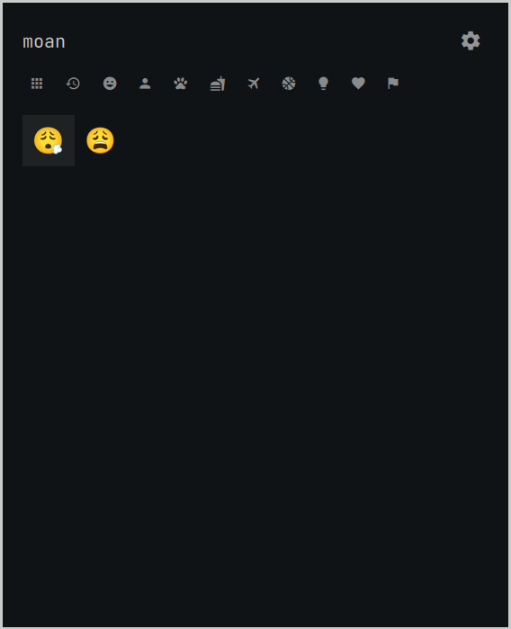
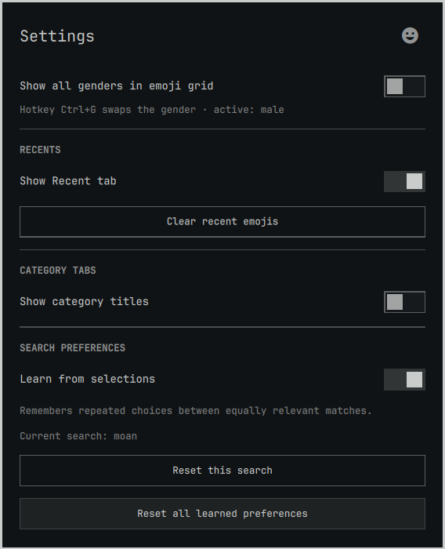

# Better Emojis for Omarchy

An Omarchy emoji picker with English and Persian search, everyday reaction
aliases, and local preferences that learn which equally relevant emoji you
choose. Open it with `Super + Ctrl + E`.

This is [Sadra's fork](https://github.com/sadraalikhah/omarchy-better-emojis)
of [Wessel Boers' Better Emojis](https://github.com/Wessel-Boers/omarchy-better-emojis).
It retains the original plugin ID, `wessel.better-emojis`.



## Install

On an Omarchy installation with its Quickshell shell running:

```bash
omarchy plugin add https://github.com/sadraalikhah/omarchy-better-emojis.git --enable
```

Press `Super + Ctrl + E`, type a search, and select an emoji. `Enter` inserts
it and leaves it on the clipboard. `Ctrl + Enter` copies it.

If the original Better Emojis plugin is already installed, both repositories
use the same ID. Follow [Switch an existing installation to this fork](docs/usage.md#switch-an-existing-installation-to-this-fork).

## Features

| Feature | Behavior |
| --- | --- |
| English and Persian search | Searches localized names, keywords, and curated expressions. |
| Everyday reactions | Includes terms such as `moan`, `overwhelmed`, `miss you`, and `ناله`. |
| Ranked matching | Preserves alias phrases, requires every query word, and uses typo matching when direct matches are absent. |
| Local learning | Three deliberate choices can reorder equal matches for that exact normalized search. Stronger matches stay ahead. |
| Category tabs | Icons by default, with optional titles in Settings. |
| Recent emojis | Remembers up to 30 selections. |
| Emoji-name tooltips | Shows the English name after a 600 ms pause with the mouse or keyboard. |
| Skin tones and genders | Supports a default skin tone, all-tone display, and combined or separate gender variants. |
| Adjustable layout | Three presets each for emoji size, picker width, and picker height. |
| Clipboard retention | Inserted emojis remain available for subsequent pastes. |

The generated dataset contains 1,914 base entries, with English and Persian
annotations. The curated alias file adds 367 expressions across 51 emojis.
[Development documentation](docs/development.md#check-dataset-counts) includes
commands to verify these counts.

## Documentation

- [Use and manage the picker](docs/usage.md): install, switch from upstream,
  select emojis, manage learning, update, remove, and troubleshoot.
- [Settings and shortcuts](docs/reference.md): defaults, keyboard controls,
  runtime requirements, and stored state.
- [Search and learning](docs/search.md): relevance scoring, typo matching,
  deliberate choices, decay, and ranking guarantees.
- [Develop and maintain the plugin](docs/development.md): code layout, tests,
  aliases, generated data, and desktop verification.
- [Changelog](CHANGELOG.md): changes made in this fork.

## Search preferences

Learning is enabled by default. It records mouse clicks and keyboard
selections made after moving the emoji cursor. Hovering and accepting the
automatically selected first result do not count.

Preferences stay on your machine in a separate `learning.json` file. Settings
lets you stop learning, reset the current search, or reset all preferences.
Turning learning off restores ordinary search ranking and retains saved
preferences for later use.



## License and attribution

Plugin code is covered by the [MIT license](LICENSE). The original author is
Wessel Boers; this fork is maintained by
[Sadra](https://github.com/sadraalikhah).

Generated Unicode Emoji and CLDR data are covered by the
[Unicode License v3](UNICODE-LICENSE.txt). Supplemental emojilib keywords are
covered by the [emojilib MIT license](EMOJILIB-LICENSE.txt).
