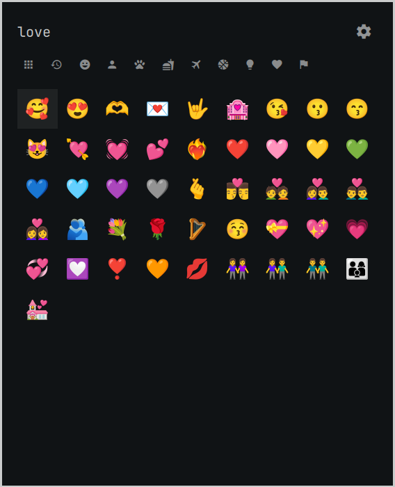

# Better Emojis for Omarchy

A drop-in replacement for the built-in Omarchy emoji picker (`Super + Ctrl + E`)
with category tabs, recents, skin tones, gender variants, and adjustable sizing.
Designed to adhere to Omarchy conventions — fully keyboard-accessible, Nerd
Fonts icons for categories, and instant open/close with no lag.

This fork adds ranked English/Persian search, colloquial aliases, clipboard
retention after insertion, and optional category titles. It is based on
[Wessel Boers' Better Emojis](https://github.com/Wessel-Boers/omarchy-better-emojis).




## Install

```bash
omarchy plugin add https://github.com/sadraalikhah/omarchy-better-emojis.git --enable
```

That's it. The plugin registers itself as the implementation behind
`omarchy.emojis`, so your existing `Super + Ctrl + E` binding opens it and the
stock picker is disabled automatically. Removing the plugin restores the stock
picker:

```bash
omarchy plugin remove wessel.better-emojis
```

## Features

- **Category tabs** — Icons by default; enable Show category titles in Settings
  to display names beside them. All, Recent, Smileys & Emotion, People & Body,
  Animals & Nature, Food & Drink, Activities, Travel & Places, Objects,
  Symbols, Flags. Search ranks matches across every category and requires all
  query words to match.
- **English and Persian search** — names and keywords come from CLDR, with
  emojilib's English keywords added as a lower-ranked supplement. Search
  normalizes Persian ی/ي, ک/ك, diacritics, and half-spaces, and includes
  curated English and Persian colloquial terms.
- **Everyday reactions** — 367 curated aliases across 51 emojis cover terms
  such as moan/moaning, overwhelmed, awkward, dying of laughter, miss you,
  and got it. Searching moan includes both 😮‍💨 and 😩.
- **Fuzzy ranking** — exact aliases and names rank first, followed by CLDR
  keywords and partial matches. One-character typo matches are used when no
  direct matches exist. The local scorer adds no runtime dependency.
  Alias phrases stay separate so exact phrases rank above scattered words;
  extra synonyms do not inflate relevance. Short queries match whole words
  or prefixes, so moan does not match Samoan flags.
- **Recents** — the last inserted emojis are remembered and available from
  the Recent tab. Normal selection pastes into the focused app and leaves the
  emoji on the regular clipboard; `Ctrl + Enter` remains copy-only.
- **Emoji names** — pause on an emoji with the mouse or keyboard for 600 ms
  to see its name in a themed tooltip.
- **Skin tones** — choose a default tone in Settings or show all five exact
  Unicode tone variants beside each base emoji. Cycle through with a hotkey.
  The grid never shows duplicate standalone tone variants.
- **Gender variants** — man, woman, and variants are combined by default. Cycle
  through with a hotkey or enable all gender variants in Settings when you want them shown separately.
- **Settings page** — the gear switches the overlay from the emoji grid to a
  dedicated Settings page. The emoji icon returns to the grid.
- **Preset sizing** — emoji size (Normal / Large / Extra Large), window width
  (Normal / Wide / Extra Wide), and window height (Normal / Tall / Extra Tall).
  Grid columns distribute evenly across the complete overlay width at every size.
- **Keyboard navigation** — Tab to different categories and access the settings menu with a hotkey. Settings itself 
  uses group-level navigation: Tab and Shift+Tab move between groups, Up and Down move between groups, and Left and
  Right select options within the active group.
- **Copy mode** — `Ctrl + Enter` copies instead of typing into the focused app.
- **Theme aware** — uses Omarchy menu tokens, `Button`, `Toggle`, and
  `PanelSeparator` components. Toggle shapes follow system corner roundedness.
- **Nerd Font navigation icons** — category tabs and view navigation use the
  same Nerd Font icon style as the Omarchy bar.
- **1,914 emojis** — generated in Unicode order from Emoji 17.0
  `emoji-test.txt`, CLDR 48.2 English and Persian annotations, and emojilib
  4.0.3 English keywords.

## Keyboard shortcuts

| Key | Action |
| --- | --- |
| type | Search all categories |
| `Tab` / `Shift + Tab` | Next / previous category tab |
| `Ctrl + 1` … `Ctrl + 9` | Jump to tab N |
| `Ctrl + T` | Cycle skin tone |
| `Ctrl + G` | Cycle displayed gender when genders are combined |
| `Ctrl + S` or `Ctrl + ,` | Open Settings / return to emojis |
| arrows / PgUp / PgDn | Move the emoji cursor |
| `Enter` | Insert selected emoji |
| `Ctrl + Enter` | Copy selected emoji |
| `Esc` | Clear search text in emoji view; dismiss the overlay from Settings |

Navigate the Settings menu with Tabs or arrows to selected options with the keyboard.

## Settings

Settings persist in
`~/.local/state/omarchy/plugins/wessel.better-emojis/settings.json`
(deliberately outside the plugin folder so `omarchy plugin update` stays a clean
fast-forward): emoji size, window width/height, chosen skin tone, recent
emojis, skin-tone display, gender display mode and visibility. The picker
remembers the last open category, including All and Recent.

Settings include:

- Emoji size: Normal, Large, Extra Large
- Window width: Normal, Wide, Extra Wide
- Window height: Normal, Tall, Extra Tall
- Default skin tone and the all-tones grid toggle
- All-genders grid toggle, off by default so genders are combined
- Show Recent tab and Clear recent emojis
- Show category titles, off by default

## How it works

The manifest carries `"omarchy": { "clonedFrom": "omarchy.emojis" }`. The shell
routes every call made to the built-in `omarchy.emojis` id — including the
`Super + Ctrl + E` binding — to the enabled plugin that claims it, and disables
the stock picker while this one is enabled. It's the same mechanism
`omarchy plugin clone` uses, shipped as a standalone plugin.

## Development

Regenerate the emoji dataset (requires network):

```bash
python3 tools/generate_emoji_data.py
```

Run the local search, display, and clipboard behavior tests:

```bash
node tests/emoji-data.test.js
```

Validate the manifest the same way the shell does:

```bash
omarchy plugin validate .
```

For local testing, symlink or copy the repo into
`~/.config/omarchy/plugins/wessel.better-emojis/`, run
`omarchy plugin enable wessel.better-emojis`, then hit `Super + Ctrl + E`.
Edits under `~/.config/omarchy/plugins/` hot-reload.

## License

Plugin code is MIT licensed. The generated names and keywords derive from
Unicode Emoji and CLDR data, used under the Unicode License v3; see
[`UNICODE-LICENSE.txt`](UNICODE-LICENSE.txt). Supplemental English keywords
come from emojilib 4.0.3 under MIT; see [`EMOJILIB-LICENSE.txt`](EMOJILIB-LICENSE.txt).
The generator pins Emoji 17.0, CLDR 48.2, and emojilib 4.0.3. The project's
English and Persian colloquial terms are maintained in `tools/aliases.json`.
Add terms to each emoji's `en` or `fa` list there, then regenerate `emojis.json`
and run the tests. The generator preserves individual phrases in the search
database; no network lookup is needed while using the picker.
